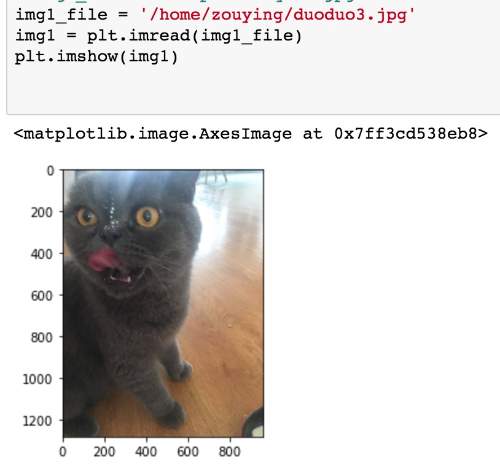
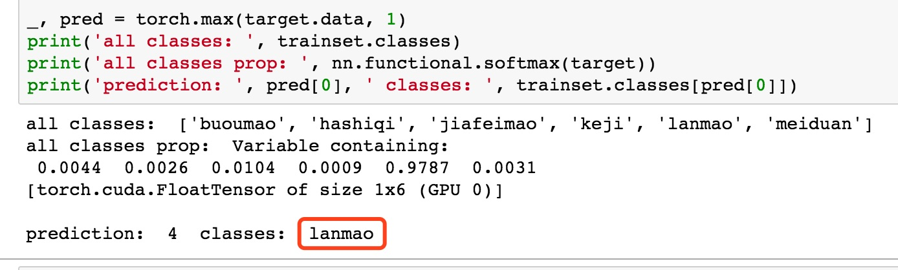

# animals-classification

Animals classification using CNN

## about network ##

Pretrained resnet18 + one full connection which from input 2048 to output num_classes.

- the input(2048) is the output layer of resnet18
- num_classes: the number of sub-directory of the root of ImageFolder
- [resnet paper](https://arxiv.org/abs/1512.03385)

## about dataset ##

Save images in ImageFolder way.

> root/dog/xxx.png  
> root/dog/xxy.png  
> root/dog/xxz.png  
>   
> root/cat/123.png  
> root/cat/nsdf3.png  
> root/cat/asd932_.png  

## run the network ##

1. change the `data_dir` (line 17) to the path of datasets
2. change test image: `image_file` (line 67)
3. run it: `python animals-classification.py`

## result ##

### test image show

### the result

## Author ##
Feel free to contact me if you have any questions: xpzouying@gmail.com
